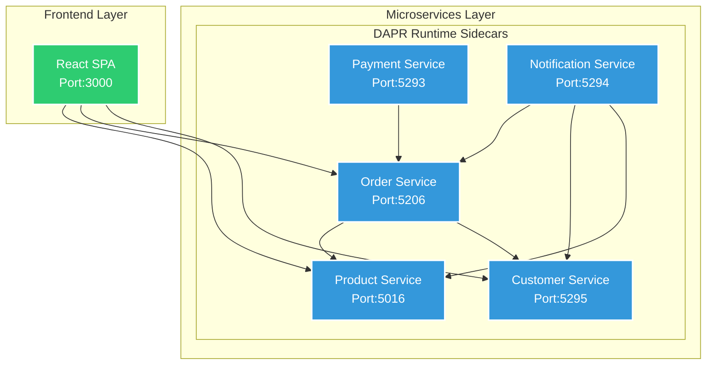
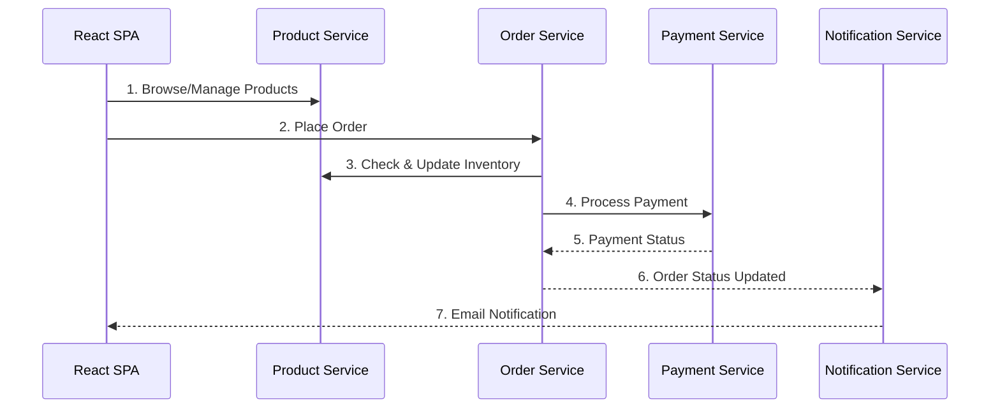
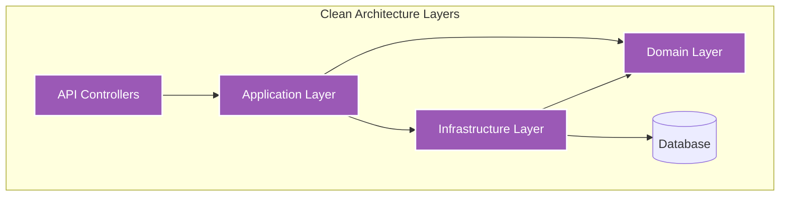
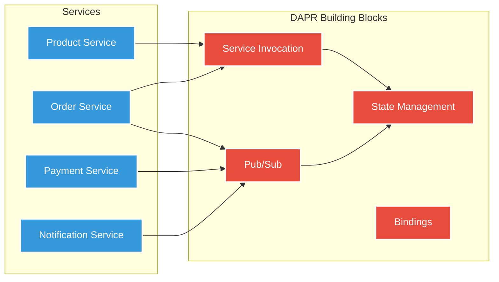
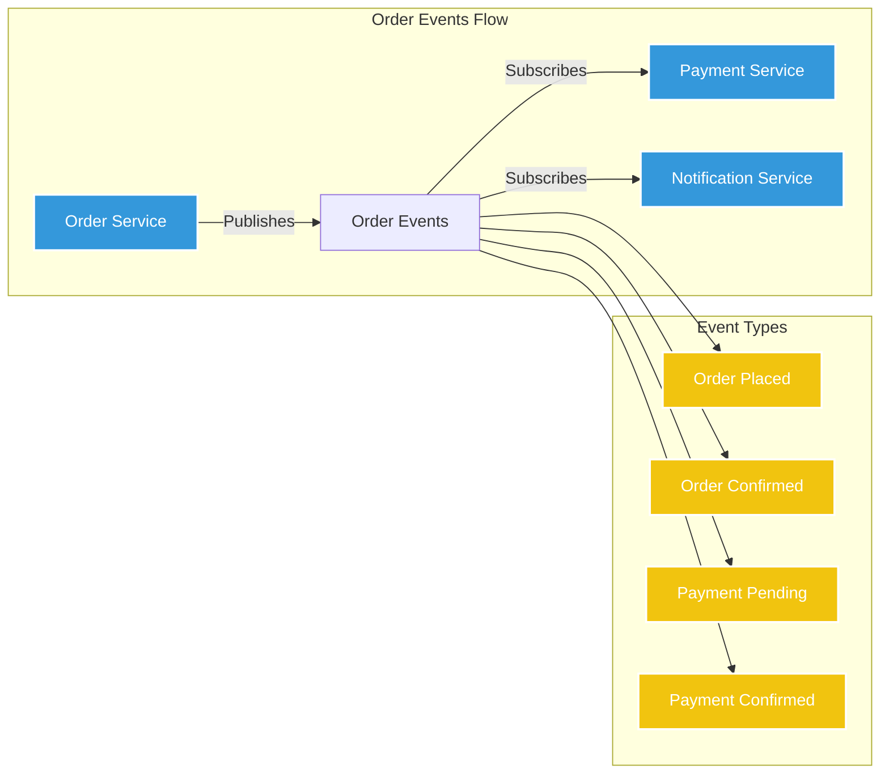

# E-Commerce Application Architecture

This document provides a visual representation of our microservices-based e-commerce application architecture using DAPR (Distributed Application Runtime).

## System Overview

## Service Communication Flow

## Clean Architecture Implementation

## DAPR Building Blocks Usage

## Event-Driven Architecture

## Service Details

### Ports & Endpoints
- Frontend (React SPA): `http://localhost:3000`
- Product Service: `http://localhost:5016`
- Order Service: `http://localhost:5206`
- Payment Service: `http://localhost:5293`
- Notification Service: `http://localhost:5294`
- Customer Service: `http://localhost:5295`

### DAPR Sidecar Ports
- Product Service: 3501
- Order Service: 3502
- Payment Service: 3503
- Notification Service: 3504
- Customer Service: 3505

## Key Architecture Characteristics

1. **Microservices Architecture**
   - Independent deployable services
   - Service-specific databases
   - DAPR-based communication

2. **Clean Architecture**
   - Separation of concerns
   - Domain-driven design
   - Layered architecture

3. **Event-Driven Design**
   - Asynchronous communication
   - Pub/sub messaging
   - Event-based workflows

4. **Cloud-Native Features**
   - Container support
   - Service discovery
   - Distributed tracing
   - State management

5. **Frontend Architecture**
   - React Single Page Application
   - Component-based design
   - React Router for navigation
   - RESTful API communication
